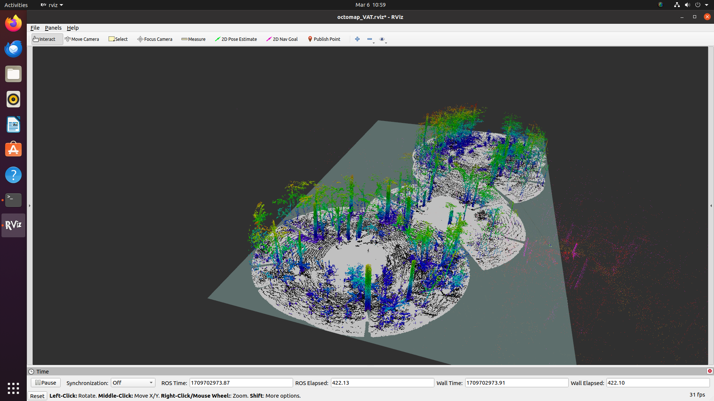
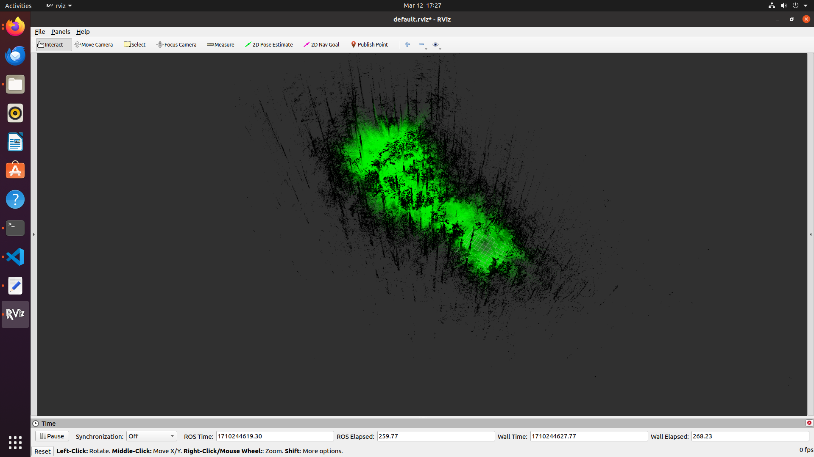
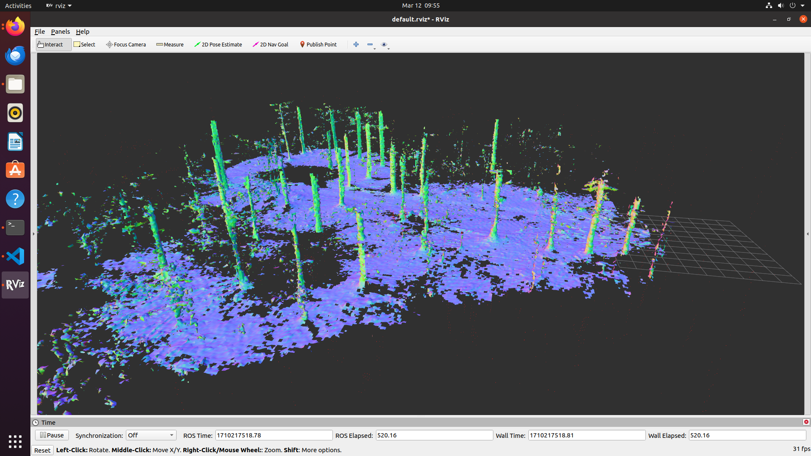

# Voxelization
# Voxelization

## Why do we need Voxelization

The volumetric quantization of 3D space is important. We can use the information for navigational tasks, such as obstacle avoidance. Getting the information of the free and occupied volumes can be leveraged by obstacle avoidance algorithms. Discretizing the space can help us embed more information into the voxel. Methods that are mentioned below are some popular methods which were compared based on a lot of different metrics
## Octomap

Octomap uses an octree data structure for voxelization. An octree recursively divides space into eight octants (cubes). Depending on the resolution and likelihood of occupancy, each octant can be partitioned or represented as a single voxel.

Occupancy likelihood: Octomap holds the likelihood that a voxel will be occupied by an obstacle in the range [0, 1]. 0 denotes open space, while 1 indicates fully occupied space. The values in between represent uncertainty.

Efficiency: The octree structure facilitates the storage and retrieval of voxel information. Only occupied or partially occupied voxels are stored, resulting in lower memory utilisation in vast settings.

## UFOMap

UFOMap, similar to Octomap, but fundamentally differs in the representation of the voxel occupancy probability. UFOMap builds on top of OctoMap's structure but utilizes a slightly different node type. It introduces the concept of an "unknown" state for each voxel, unlike OctoMap, which only uses occupied and free states, thus the name Unknown Free Occupied(UFO) Map.

Uncertainty is explicitly represented by UFOMap, allowing for a more nuanced representation of the environment, particularly in instances where sensor data is sparse or noisy. OctoMap uses an occupancy probability threshold to determine whether a voxel is free, which may not always be accurate.

Memory Efficiency: Because of the explicit representation of the unknown state, UFOMap has higher memory efficiency than OctoMap, especially in contexts with a large amount of unknown space. This is because UFOMap nodes with only unknown children can be combined into a single node.

Ray Casting: Both methods allow ray casting, which is required for collision detection and path planning. However, UFOMap may require slightly different logic to handle unknown voxels during ray casting than OctoMap's handling of occupancy probability.

## Voxblox

Voxblox is a voxel-based approach for constructing 3D representations of the world that focuses on Euclidean Signed Distance Fields. To be specific, unlike probabilities which was commonly used in Octomap, it uses Truncated Signed Distance Fields within each voxel. 

## How to use the 3D Occupancies provided

The reason for voxelization must be very clear. The voxelized 3D space must be used to localize and plan. Depending on the computational efficiency, memory efficiency and the planning algorithm development, a method must be chosen. 

We did our experimentation on the Treescopes dataset and the PCD files generated from DSO. The observations were as follows:

- The algorithms required consistent values of TF data between the sensor and the world/map frame.
- While running with the PCD file, only Octomap would provide results. The other methods didnt give an output due to lack of TF data. 
- Running with Treescope dataset:
    - Octomap provides reasonably good results in a faster time with a 5cm voxel resolution and 15m range of the sensor considered.
    - UFOMap was extremely slow in providing results at times, and would mark most voxels with uncertainity as unknown, and would only label volumes as occupied, only within a certain radius.
    - Voxblox provided a good representation of the 3D environment, which could be exported as an SDF file.  The method to further used the Signed Distance Field values were very unclear. Nonetheless there are methods which use the voxblox representation for path planning.

[3D space digital reconstruction ](https://drive.google.com/drive/folders/1JsKdpBzsU8YrjoTyUGJwXj7VEfaeMf-Q?usp=drive_link) is the folder, which contains the information about some of the documentation, results and related papers to the analysis of pointcloud voxelization.

From the brief observations, it was decided to use the Octomap method, as the method was also available for the ROS 2 distro. This spreadsheet will provide the direct comparison between the 3 methods tested.

## Future works

A localization and path planning method must be developed to utilize the voxelized environment. There are very few methods that use the voxelized 3D occupancy map for localization. Robot Localization is a good package to start with how the octomap 3D Occupancy Grid can be utilized for different purposes.

GraphPlanner uses Voxblox-based maps. This can be tested with a simulation environment to figure our how it works.

The CTU-MRS UAV stack has a component called [Octomap Planner](https://github.com/ctu-mrs/mrs_octomap_planner) this can be looked into for further development of the stack.
